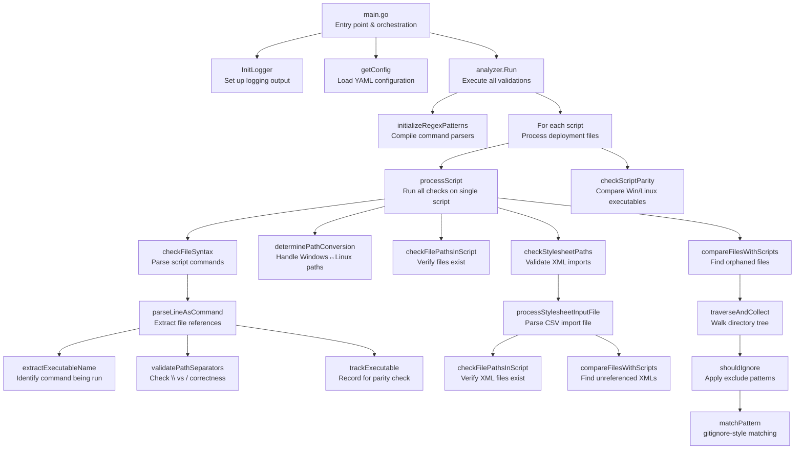

# Technical Execution Flow

This document describes the internal code flow and architecture from a technical perspective.

## Execution Flow Summary

### 1. Initialization
- **Parse CLI flags** → Get config file path (`-c` flag)
- **Initialize logger** → Open log file for detailed output
- **Load & validate config** → Parse YAML, verify required fields

### 2. Analyzer Setup
- **Compile regex patterns** → Initialize parsers for command detection
- **Set up ignore patterns** → Prepare gitignore-style matchers

### 3. Script Processing Loop (for each deployment script)

**a) Path Separator Validation** (`validatePathSeparators`)
   - **Check**: Do all file paths use correct separators for target OS?
   - **Goal**: Catch Windows paths (`\`) in Linux scripts or vice versa
   - **Example**: `C:\temp\file.xml` in `.sh` script → ERROR

**b) Syntax Analysis** (`checkFileSyntax`)
   - **Check**: Parse each command, extract file path references
   - **Goal**: Build list of all files referenced in deployment commands (validated in step 4)
   - **Example**: Extract `110-Classification/nw4NewaysClassification_ICSExportSubtree.xml` from `$TC_BIN/plmxml_import -xml_file="110-Classification/nw4NewaysClassification_ICSExportSubtree.xml"`

**c) Stylesheet Import Validation** (`checkStylesheetPaths`)
   - **Check**: Do stylesheet input files reference valid XML files?
   - **Goal**: Validate that input files for the stylesheet import utility point to real XML files
   - **Example**: Parse `200-Stylesheets/import_stylesheet.txt`, verify each XML exists → ERROR if missing

**d) Directory Content Comparison** (`compareFilesWithScripts`)
   - **Check**: Are there files in repository NOT referenced by any script?
   - **Goal**: Find orphaned files that won't be deployed
   - **Example**: `orphaned.xml` exists in repo but no script copies it → WARNING

### 4. File Existence Validation (`checkFilePathsInScript`)
- **Check**: Does each file path extracted in step 3b exist in repository?
- **Goal**: Catch typos or missing files before deployment
- **Example**: Script references `110-Classification/missing.xml` → ERROR if not found

### 5. Script Parity Check (`checkScriptParity`)
- **Check**: Do Windows and Linux scripts reference the same executables AND file paths?
- **Goal**: Ensure both deployment paths are equivalent
- **Example**: 
  - Both scripts must call the same utilities: `plmxml_import`, `preferences_manager`, `clsutility`, `make_user`, etc. → ERROR if mismatch
  - Both scripts must reference the same file paths: If Windows script has `085-Dynamic_LOV\Nw4AutomotiveClass.xml`, Linux script must have `085-Dynamic_LOV/Nw4AutomotiveClass.xml` → ERROR if missing

### 6. Results & Cleanup
- **Output validation results** → Log all errors/warnings
- **Close log file** → Release resources
- **Return exit code** → 0 if valid, 1 if errors found

---

## Architecture Overview



---

## Module Responsibilities

### 1. `main.go` (Application Entry Point)
- Parse command-line flags (`-c` for config file path)
- Initialize logger with config settings
- Load and validate configuration
- Invoke analyzer
- Handle cleanup (close log file)

**Key Functions:**
- `main()` - Entry point
- `getConfig(configPath string) (Parameters, error)` - Load YAML configuration

---

### 2. `internal/logger` (Logging System)
- Template-style logging with `{key}` placeholder substitution
- Log levels: Debug, Info, Error
- Output to stdout and optional log file
- Resource management via `defer logger.Close()`

**Key Functions:**
- `InitLogger(logfile, logLevel string) error` - Initialize logging
- `Debug/Info/Error(format string, args ...interface{})` - Log messages
- `Close() error` - Close log file handle

---

### 3. `internal/analyzer/main.go` (Orchestration)
- Main analysis orchestrator
- Processes multiple scripts sequentially
- Manages global state (pathParameters, sourceCodeRoot, ignores)
- Cross-platform path conversion logic

**Key Functions:**
- `Run(params Parameters)` - Main entry point for analysis
- `processScript(script scriptDefinition, params Parameters) error` - Process single script
  - Syntax check
  - Path conversion determination
  - File system validation
  - Directory content comparison

**Data Structures:**
```go
type Lines struct {
    Valid            map[int]string           // Line# -> Valid file path
    StyleSheetImport map[int]StyleSheetImport // Line# -> Stylesheet import definition
    Invalid          map[int]string           // Line# -> Invalid line
    Skipped          map[int]string           // Line# -> Skipped line
    Missing          []string                 // Missing executables
}

type Result struct {
    File map[string]Lines  // Script filename -> Analysis results
}
```

---

### 4. `internal/analyzer/syntax.go` (Script Parsing)
**Purpose:** Parse deployment scripts and extract file path references

**Workflow:**
1. `checkFileSyntax()` - Opens script file, processes line by line
2. `parseLineAsCommand()` - Parses each line for commands with path parameters
3. `validatePathSeparators()` - Validates separators match target OS
4. `extractExecutableName()` - Identifies command/executable
5. `trackExecutable()` - Records executables for parity checking

**Regex Patterns (compiled once for performance):**
- `parameterFlagPattern` - Matches `-flag=value` patterns
- `parameterValuePattern` - Extracts quoted/unquoted values
- `stylesheetUtilityRegex` - Identifies stylesheet import commands
- `stylesheetFlagsRegex` - Extracts stylesheet-specific flags

**Path Separator Validation:**
```
Windows script (.bat): Must use backslash (\)
Linux script (.sh):    Must use forward slash (/)
```

**Key Functions:**
- `initializeRegexPatterns(params []string) error` - Compile regex patterns
- `checkFileSyntax(scriptFile, sourceCodeRoot, targetOS string)`
- `parseLineAsCommand(line string, lineNumber int, scriptFile, targetOS string)`
- `validatePathSeparators(path, targetOS, scriptFile string, lineNumber int) bool`
- `checkScriptParity(scripts []scriptDefinition)` - Verify Windows/Linux script parity
  - Compare executables called by both scripts
  - Compare file paths referenced by both scripts (normalized for cross-platform)

---

### 5. `internal/analyzer/content.go` (Directory Traversal)
**Purpose:** Compare repository files with script references

**Workflow:**
1. `compareFilesWithScripts()` - Main comparison function
2. `traverseAndCollect()` - Walk directory tree, collect file paths
3. `shouldIgnore()` - Check if path matches ignore patterns
4. `matchPattern()` - gitignore-style pattern matching

**Error Handling Strategy:**
- Collect all errors during traversal (don't stop on first error)
- Return partial results even if errors occurred
- Log errors immediately, return summary at end

**Key Functions:**
- `matchPattern(pattern, path string) bool` - gitignore-style matching
- `shouldIgnore(path string, ignorePatterns []string) bool` - Check multiple patterns
- `traverseAndCollect(root string, ignorePatterns []string) ([]string, error)` - Collect files with error collection
- `compareFilesWithScripts(script string, validLines map[int]string, root string, ignorePatterns []string) error` - Main comparison

**Pattern Matching:**
Uses `github.com/sabhiram/go-gitignore` library for gitignore-style patterns:
- `*.log` - Match file extensions
- `build/` - Match directories
- Supports negation patterns (if library supports)

---

### 6. `internal/analyzer/stylesheetImport.go` (Stylesheet Validation)
**Purpose:** Validate stylesheet XML import definitions

**Workflow:**
1. `checkStylesheetPaths()` - Process all stylesheet imports in script
2. `processStylesheetInputFile()` - Process single import file (proper defer cleanup)
3. Parse CSV-style input file (format: `name,filename.xml`)
4. Validate XML files exist on disk
5. Compare repository XMLs with import references

**Resource Management:**
- Extracts file processing to separate function for proper `defer file.Close()`
- Prevents file handle leaks in loop

**Key Functions:**
- `checkStylesheetPaths(scriptFile string, styleSheetImport map[int]StyleSheetImport)`
- `processStylesheetInputFile(importDefinition StyleSheetImport) error` - Process with proper cleanup

**Data Structures:**
```go
type FilePathInfo struct {
    RelativePath string
    AbsolutePath string
}

type FilePathMap map[int]FilePathInfo

func (fpm FilePathMap) Paths(pathType string) (map[int]string, error)
```

---

### 7. `internal/analyzer/path.go` (Path Validation)
**Purpose:** Validate file paths exist on file system

**Key Functions:**
- `checkFilePathsInScript(scriptFile string, lines map[int]string)` - Validate all paths
- `fileExists(path string) bool` - Check if file exists (with path conversion)

**Cross-Platform Handling:**
- Uses `sourceCodeRoot` as base path
- Converts path separators based on runtime OS
- Uses `filepath.Join()` for OS-specific path construction

---

### 8. `internal/analyzer/utils.go` (Utility Functions)
**Purpose:** Shared utility functions for path and pattern manipulation

**Key Functions:**
- `determinePathConversion(targetOS, scriptFilename string) (from, to string, err error)`
  - Determines if path separator conversion needed
  - Windows target on Linux runtime: `\` → `/`
  - Linux target on Windows runtime: `/` → `\`
  - Matching OS: no conversion
  - Returns error for invalid target OS

- `replaceInMap(inputMap map[int]string, oldChar, newChar string) map[int]string`
  - Replace characters in all map values
  
- `replaceInIgnorePatterns(patterns ignorePatterns, oldChar, newChar string) ignorePatterns`
  - Replace characters in both Global and StyleSheetsFolder pattern slices

### Data Structures

The analyzer uses these key data structures throughout processing:

**Result and Lines Types:**
```go
type Lines struct {
    Valid            map[int]string           // Line# -> Valid file path
    StyleSheetImport map[int]StyleSheetImport // Line# -> Stylesheet import definition
    Invalid          map[int]string           // Line# -> Invalid line
    Skipped          map[int]string           // Line# -> Skipped line
    Missing          []string                 // Missing executables
}

type Result struct {
    File map[string]Lines  // Script filename -> Analysis results
}
```

**Stylesheet Types:**
```go
type FilePathInfo struct {
    RelativePath string
    AbsolutePath string
}

type FilePathMap map[int]FilePathInfo

func (fpm FilePathMap) Paths(pathType string) (map[int]string, error)
```
