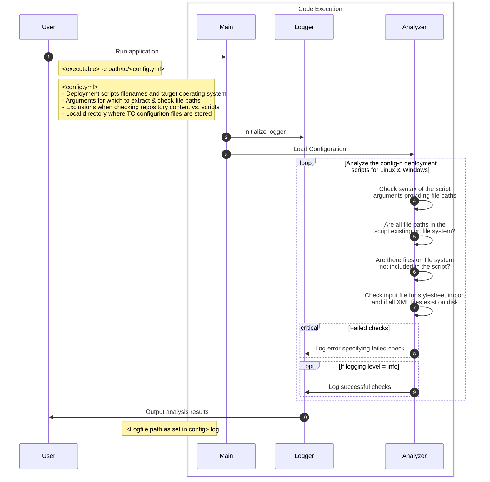

# Execution flow


# Example configuration file
```yml
scripts:
  - filename:	DeploymentInstructions.bat
    target_os:	windows
  - filename:	DeploymentInstructions.sh
    target_os:	linux
path_parameters:
  - input
  - xml_file
  - name
  - path
  - file
source_code_root: "/path/to/configuration/repo"
ignore_patterns:
  global:
    - "001-Start_Automation"
    - "003-Infrastructure_Automation"
    - "040-SourceCode"
    - "058-Application"
    - "060-Binaries"
    - "070-BMIDE"
    - "090-BatchLoV"
    - "200-Stylesheets" # path for stylesheet XMLs is checked separately
    - "900-Import_Export_Tools"   
    - "950-APE"
    - "BNL-Import_Export_Tools"
    - "*.adoc"
    - "Policy and Best Practices.txt"
    - "readme.txt"
    - "README.md"
    - "DeploymentInstructions.bat"
    - "DeploymentInstructions.sh"
  stylesheets_folder:
    - "*.txt"
logfile: execution.log
```